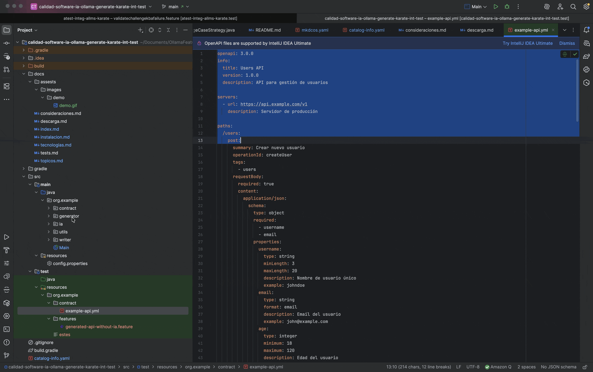

<h1 style="text-align: center;">
  <br>
  <a href="#"></a>
  <br>
  calidad-software-ia-int-test-karate-java-ollama-generate-features
  <br>
</h1>

<div align="center">
  
  
  
  
</div>

## 🎯 Descripción

**calidad-software-ia-int-test-karate-java-ollama-generate-features** es una herramienta de automatización QA que transforma contratos de API (OpenAPI 3.0) en archivos `.feature` ejecutables de Karate, reduciendo el tiempo de creación de casos de prueba de horas a minutos.

<p style="text-align: center;">
  <a href="consideraciones.md">Tópicos</a> •
  <a href="tecnologias.md">Tecnologías</a> •
  <a href="consideraciones.md">Consideraciones</a> •
  <a href="descarga.md">Descarga</a> •
  <a href="instalacion.md">Instalación y ejecución</a> •
  <a href="#autores">Autores</a> •
  <a href="#relacionados">Relacionados</a> •
  <a href="#roadmap">Roadmap</a>
</p>




## Autores

<br><sub>Mateo Arroyave Quintero<br>Auxiliar De Calidad De Software</sub>


### Problema que Resuelve

En proyectos con múltiples APIs, crear manualmente casos de prueba para cada endpoint es:
- ⏰ Lento y repetitivo
- ❌ Propenso a errores humanos
- 📉 Inconsistente entre equipos
- 🔄 Difícil de mantener

### Solución

Generación automatizada de escenarios de prueba completos:
- ✅ Happy paths
- ✅ Validaciones de campos
- ✅ Manejo de errores (4xx, 5xx)
- ✅ Edge cases y límites
- 🤖 Enriquecimiento con IA (opcional)

---

## 🚀 Inicio Rápido
```bash
# 1. Clonar repositorio
git clone <repo-url>
cd contract-to-feature-generator

# 2. Configurar contrato
cp mi-api.yml src/main/resources/contracts/

# 3. Editar configuración
nano src/main/resources/config.properties

# 4. Ejecutar
./gradlew run
```

**Resultado:** Archivo `.feature` generado en `src/test/resources/features/`

---

## 📊 Ejemplo

### Entrada: `api-contract.yml`
```yaml
paths:
  /users:
    post:
      summary: Crear usuario
      requestBody:
        required: true
        content:
          application/json:
            schema:
              type: object
              required: [username, email]
              properties:
                username:
                  type: string
                  minLength: 3
                email:
                  type: string
                  format: email
```

### Salida: `users-api.feature`
```gherkin
Feature: Users API

  @smoke @happyPath
  Scenario: Crear usuario - Happy Path
    * def requestBody = { username: 'john', email: 'john@test.com' }
    Given url baseUrl + '/users'
    And request requestBody
    When method POST
    Then status 201
    And match response.id == '#uuid'

  @validation
  Scenario: Validar error cuando falta username
    * def requestBody = { email: 'john@test.com' }
    Given url baseUrl + '/users'
    And request requestBody
    When method POST
    Then status 400
```

**Tiempo de creación:** ~5 segundos para 12+ escenarios

---

## 🏗️ Arquitectura
```
┌─────────────────┐
│  Contrato YML   │
│  (OpenAPI 3.0)  │
└────────┬────────┘
         │
         v
┌─────────────────┐
│  YAML Parser    │ ◄── SnakeYAML + Jackson
└────────┬────────┘
         │
         v
┌─────────────────┐
│ Modelo Interno  │ ◄── Endpoints, Parameters, Schemas
└────────┬────────┘
         │
         v
┌─────────────────┐
│   Estrategias   │ ◄── Happy Path, Validations, Errors, Edge Cases
└────────┬────────┘
         │
         v
┌─────────────────┐
│ Enriquecimiento │ ◄── Ollama + Mistral (opcional)
│       IA        │
└────────┬────────┘
         │
         v
┌─────────────────┐
│ Feature Writer  │
└────────┬────────┘
         │
         v
    .feature
   (Karate DSL)
```

---

## 📦 Componentes Principales

| Componente | Responsabilidad |
|-----------|-----------------|
| **YamlContractParser** | Parsea contratos OpenAPI |
| **ScenarioGenerator** | Orquesta la generación de escenarios |
| **Estrategias** | Implementan lógica de cada tipo de prueba |
| **MistralEnricher** | Enriquece escenarios con IA |
| **KarateTemplateEngine** | Genera sintaxis Karate |
| **FeatureFileWriter** | Escribe archivos finales |

---

## 🎓 Casos de Uso

### Caso 1: Microservicios
Generar pruebas para 10+ microservicios en minutos

### Caso 2: Regresión
Actualizar pruebas automáticamente cuando cambia el contrato

### Caso 3: Estandarización
Asegurar consistencia en pruebas de todo el equipo QA

### Caso 3: Onboarding
Nuevos QAs generan pruebas complejas desde día 1

---

## 📚 Documentación Adicional

- [Tecnologías](tecnologias.md)
- [Instalación](instalacion.md)
- [Consideraciones](consideraciones.md)

---


## Roadmap

- [Guía QA](https://github.com/orgs/somospragma/repositories?q=qa) - (En construcción) Una guía de proyectos Orientados a la Calidad de Software
