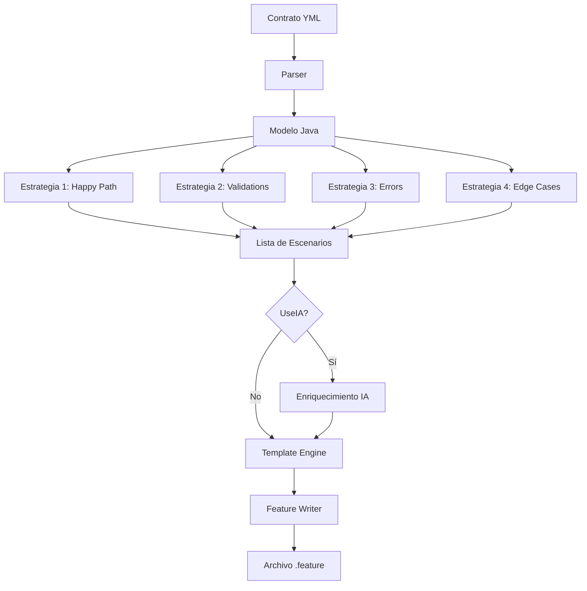

# Tópicos y Características

## 🎯 Funcionalidades Principales

### 1. Parseo de Contratos OpenAPI

**Descripción:** Lee y parsea contratos en formato YAML (OpenAPI 3.0).

**Características:**
- ✅ Soporte completo OpenAPI 3.0
- ✅ Extracción de endpoints, métodos, parámetros
- ✅ Procesamiento de request/response schemas
- ✅ Validación de tipos de datos
- ✅ Detección de campos requeridos

**Ejemplo:**
```java
YamlContractParser parser = new YamlContractParser();
ApiContract contract = parser.parse("api-contract.yml");
// Resultado: Objeto Java con toda la estructura
```

---

### 2. Generación Multi-Estrategia

El generador implementa 4 estrategias de prueba:

#### 2.1 Happy Path Strategy
Genera casos exitosos con datos válidos.

**Características:**
- Datos de ejemplo del contrato
- Valores por defecto según tipo
- Assertions completas de respuesta
- Tags: `@smoke`, `@happyPath`, `@regression`

**Ejemplo generado:**
```gherkin
Scenario: Crear usuario - Happy Path
  * def requestBody = { username: 'john', email: 'john@test.com' }
  Given url baseUrl + '/users'
  When method POST
  Then status 201
  And match response.id == '#uuid'
```

#### 2.2 Validation Strategy
Valida campos requeridos, vacíos y tipos incorrectos.

**Escenarios generados:**
- Campo requerido faltante
- Campo vacío
- Tipo incorrecto
- Formato inválido

**Ejemplo:**
```gherkin
Scenario: Validar error cuando falta username
  * def requestBody = { email: 'test@test.com' }
  Given url baseUrl + '/users'
  When method POST
  Then status 400
  And match response.message contains 'username'
```

#### 2.3 Error Strategy
Genera escenarios para códigos de error definidos.

**Códigos soportados:**
- 400 Bad Request
- 401 Unauthorized
- 403 Forbidden
- 404 Not Found
- 409 Conflict
- 422 Unprocessable Entity
- 500 Internal Server Error

#### 2.4 Edge Case Strategy
Prueba valores límite y casos extremos.

**Escenarios:**
- Strings en longitud máxima/mínima
- Caracteres especiales
- Números negativos
- Valores fuera de rango
- Arrays vacíos

---

### 3. Enriquecimiento con IA

**Tecnología:** Ollama + Mistral (local)

**Mejoras que aplica:**
1. **Validaciones detalladas**
```gherkin
   # Antes:
   Then status 200
   
   # Después:
   Then status 200
   And match response.id == '#string'
   And match response.id == '#uuid'
   And match response.email == '#email'
   And match response.createdAt == '#? _ != null'
```

2. **Logs útiles**
```gherkin
   * def userId = response.id
   And print 'User created with ID:', userId
```

3. **Variables para reuso**
```gherkin
   * def userId = response.id
   * def userToken = response.token
```

**Configuración:**
```properties
UseIA=true
IA=Mistral
OllamaURI=http://localhost:11434/api/generate
```

---

### 4. Configuración Flexible

**Archivo:** `config.properties`
```properties
# Rutas
ContractPath=src/test/resources/org.example/contract/example-api.yml
OutputPath=src/test/resources/org.example/features/generated-api.feature

# IA
UseIA=true
IA=Mistral
OllamaModel=mistral

# Estrategias
GenerateHappyPath=true
GenerateValidations=true
GenerateErrorCases=true
GenerateEdgeCases=true
```

---

### 5. Validadores Karate Integrados

El generador usa validadores nativos de Karate:

| Validador | Descripción | Ejemplo |
|-----------|-------------|---------|
| `#string` | Cualquier string | `match response.name == '#string'` |
| `#number` | Número entero o decimal | `match response.age == '#number'` |
| `#boolean` | true o false | `match response.active == '#boolean'` |
| `#uuid` | UUID válido | `match response.id == '#uuid'` |
| `#email` | Email válido | `match response.email == '#email'` |
| `#array` | Array | `match response.items == '#array'` |
| `#object` | Objeto JSON | `match response.user == '#object'` |
| `#present` | Campo existe | `match response.data == '#present'` |
| `#null` | Campo es null | `match response.deleted == '#null'` |

---

### 6. Background Automático

Cada feature incluye un background configurable:
```gherkin
Background:
  * def config = read('classpath:karate-config.js')
  * def baseUrl = 'https://api.example.com/v1'
  * def token = Java.type('utils.TokenGenerator').getToken()
  * header Content-Type = 'application/json'
  * header Accept = 'application/json'
```

---

### 7. Tags Inteligentes

Cada escenario recibe tags según su tipo:

| Tag | Cuándo se usa | Propósito |
|-----|---------------|-----------|
| `@smoke` | Happy paths | Tests críticos |
| `@happyPath` | Casos exitosos | Flujos principales |
| `@validation` | Validaciones | Tests de entrada |
| `@error` | Errores 4xx/5xx | Manejo errores |
| `@edgeCase` | Casos límite | Robustez |
| `@regression` | Todos | Suite completa |


---

### 8. Logging Estructurado

**Framework:** SLF4J + Logback

**Niveles:**
- `INFO`: Progreso general
- `DEBUG`: Detalles de parseo
- `WARN`: Advertencias (IA no disponible, etc.)
- `ERROR`: Errores críticos

**Ejemplo de salida:**
```
15:30:45 INFO  Main - 🚀 Contract-to-Feature Generator - Iniciando...
15:30:46 INFO  YamlContractParser - 📄 Parseando contrato: api.yml
15:30:46 DEBUG YamlContractParser -   ✓ Parseado: POST /users
15:30:47 INFO  ScenarioGenerator - 🔨 Generando escenarios base...
15:30:48 INFO  MistralEnricher - 🦙 Enriqueciendo con Ollama...
15:30:50 INFO  Main - ✅ GENERACIÓN COMPLETADA
```

---

## 🔄 Flujo Completo


---

## 📈 Métricas de Generación

**Ejemplo con API de 5 endpoints:**

| Métrica | Valor |
|---------|-------|
| Endpoints | 5 |
| Escenarios generados | 28 |
| Tiempo de generación | ~8 segundos |
| Tiempo manual estimado | ~4 horas |
| **Ahorro de tiempo** | **99.9%** |

---

## 🎯 Ventajas vs Creación Manual

| Aspecto | Manual | Automatizado |
|---------|--------|--------------|
| **Tiempo** | 30-60 min/endpoint | 5 seg/endpoint |
| **Cobertura** | Variable (60-80%) | Completa (100%) |
| **Consistencia** | Depende del QA | Siempre igual |
| **Mantenimiento** | Alto | Bajo (re-generar) |
| **Onboarding** | Requiere expertise | Inmediato |
| **Estándar** | Variable | Uniforme |

---

## 🔮 Roadmap

### Versión 1.1
- [ ] Soporte para OpenAPI 3.1
- [ ] Generación de datos de prueba realistas (Faker)
- [ ] Soporte para autenticación OAuth2

### Versión 1.2
- [ ] CLI interactiva
- [ ] Batch processing (múltiples contratos)
- [ ] Generación de reportes HTML

### Versión 2.0
- [ ] Integración con Gemini (cloud)
- [ ] Generación de scenarios con datos parametrizados
- [ ] Plugin para Gradle